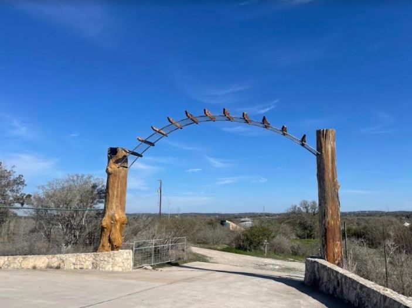

```{r setup, include=FALSE}
knitr::opts_chunk$set(echo=FALSE, message=FALSE, warning=FALSE)
```

It's finally our wedding weekend! We're excited to see all of you. Please see below for important information for the wedding day:

- The ceremony will start promptly at 4pm.

- The address for Cypress Valley in maps *might* take you to the wrong entrance gate. You'll want to enter at the property's first gate (pictured below), which is ~0.9 miles down Paleface Ranch Road off Route 71 [if you're coming in from the east]. If it's helpful, coordinates on Google Maps are: (30.420386, -98.106565). Once you go through the gate, follow the road to the right to the parking area.

<center></center>

\ 

- Again, if you intend to use rideshare to travel to the venue, we encourage you to schedule your ride in advance, especially for your ride back to your lodging. The venue is in a rural area, and on-demand late-night rides may be hard to come by.

<center></center>

