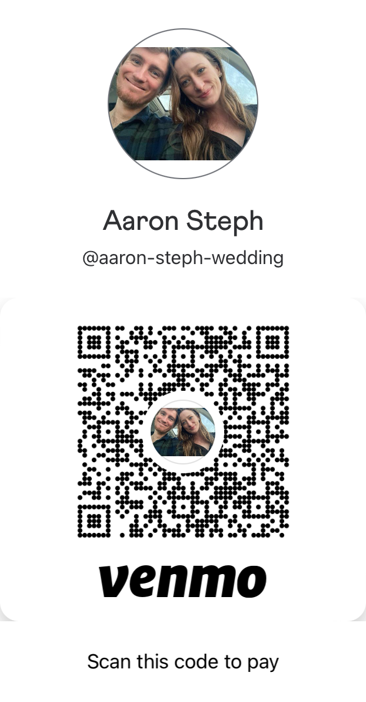

```{r setup, include=FALSE}
knitr::opts_chunk$set(echo=FALSE, message=FALSE, warning=FALSE)
```

We know most of you are travelling from far and wide to join us for our wedding. We are very grateful for attendance, and do not expect any gifts. Your presence is the best gift we could ask for, and we are thrilled to share our joy with you!

For those who would like to give anyway, we ask that you contribute to our charities of choice or honeymoon fund. If you choose to give, we really encourage you to donate to one (or both!) of our charities -- these are important organizations to us, and we are excited for the opportunity to raise money for their efforts.

## {.tabset}

### Aaron

**Pana’ewa  Rainforest Zoo & Gardens**

Yes, I know it's a bit odd to have my charity of choice be a zoo in Hawaii. But this zoo is one of my favorite memories with Stephanie -- walking around a lush garden in a light rain, meeting a parrot who could say my name, and seeing so many animals I never even knew were real (including my personal favorite, the bearcat). This was an incredible experience for Steph and I and, more importantly, is a top notch free resource for residents of the Big Island to get immersed with and excited about local ecology. You can learn more about the zoo [here](https://hilozoo.org/). These donations will go toward the zoo's conservation efforts and keeping it free to visit.

### Steph

**Veterans Legal Assistance Program**

I volunteer with the Veterans Legal Assistance Program here in Austin to provide pro bono legal services to veterans in need. This is a wonderful program led by a dedicated team of people who care about helping veterans in our community. I got my start working in a pro bono legal services office and I will always carry that experience with me. I feel so fortunate that I found my passion in estate planning while working at pro bono wills clinics and these cases will always be close to my heart. Donations will help keep VLAP's great work going.

### Honeymoon Fund

Don't ask Aaron about obscure places in the Arctic Circle or Stephanie about Italy unless you want to get locked in a two hour conversation! Traveling together has been a hallmark of our relationship -- from early road trips to America's last Popeye's buffet, to a Big Bend trek that set the stage for our move to Texas, to ferry boat quests to the fjords of Newfoundland. Wherever we choose to celebrate our honeymoon, we know it'll be an adventure to rival all those before it.

#

#### **How to give**

To give to any of these, please use the Venmo QR code or handle below, indicating how you'd like your money contributed in the payment description (e.g., "zoo", "vlap", "honeymoon"). If your you'd like your gift split to multiple funds, please also indicate the amount you'd like to go to each.

<center></center>

